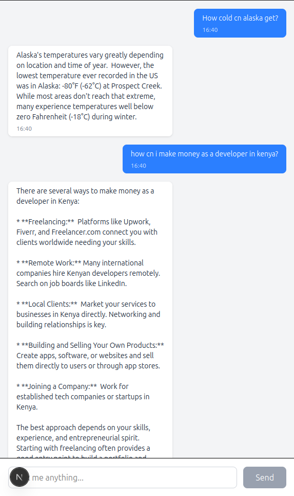

# LM Chat App

A full-stack AI chat application built to demonstrate Python (FastAPI) and frontend (Next.js + TailwindCSS).



---

## Objectives

- Build a responsive web interface for users to:
  - Input questions in a clean chat-style UI
  - Receive real-time, structured responses from a Language Model (LLM)
  - View past query history

- Create API using FastAPI:
  - Validate user input
  - Handle queries via LLM
  - Expose documentation via Swagger

---
**Backend:**  
- FastAPI  
- Uvicorn  
- Pydantic  
- dotenv
- google-generativeai

**Frontend:**  
- Next.js  
- React  
- TailwindCSS  
- JSX

---

## Running the App Locally

### 🔹 Backend (FastAPI)

```bash
cd backend
cp .env.template .env
pip install -r requirements.txt
uvicorn app.main:app --reload
```
### 🔹 Frontend (NextJS)

```bash
cd frontend
npm i
npm run dev
```

### 🔹 Getting Your Gemini API Key (Free Tier)

To use the chatbot, you'll need an API key for Google's Gemini model.

### Recommended Method: Google AI Studio

- Visit [Google AI Studio](https://makersuite.google.com/)
- Sign in with your Google account
- Click on **"Get API key"** or navigate to the **"API keys"** section
- Agree to the terms and conditions if prompted
- Click **"Create API key"**
- Copy and securely save your API key

Set the key To your .env file GEMINI_API_KEY